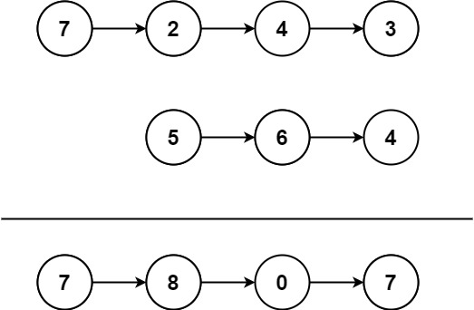

### Add Two Numbers II

#### Example

<div align=center>

</div>

* Input: l1 = [7,2,4,3], l2 = [5,6,4]
* Output: [7,8,0,7]
_
* Input: l1 = [2,4,3], l2 = [5,6,4]
* Output: [8,0,7]
_
* Input: l1 = [0], l2 = [0]
* Output: [0]


```python
# 可以用list存储所有节点，方便随时取用，但这样的空间复杂度太大，在链表特别长时，影响很大。
class Solution:
    def addTwoNumbers(self, l1: Optional[ListNode], l2: Optional[ListNode]) -> Optional[ListNode]:
        stack1, stack2 = [], [] # 首先用两个列表记录所有节点
        while l1:
            stack1.append(l1.val)
            l1 = l1.next
        while l2:
            stack2.append(l2.val)
            l2 = l2.next
        carry, head = 0, None # carry进位符
        while stack1 or stack2 or carry:
            d1 = stack1.pop() if stack1  else 0 # 如果列表1还有值，则通过pop方式取出，pop默认从末尾弹出
            d2 = stack2.pop() if stack2 else 0 # 同上
            carry, val = divmod(d1+d2+carry, 10) # divmod(a,b)返回a除以b的商和余数
            head = ListNode(val, head) # 余数val作为剩下的值留在当前节点，进位符carry继续记录。
            # head = ListNode(val, head) 的写法，让head指代的位置前进了一位，表示接下来算倒数第二位，第三位，。。。
        return head

# 另一种合适的方法应该是先将链表反转，然后对应位相加，同时记录进位符，这样空间复杂度就可以保持O(1)
```